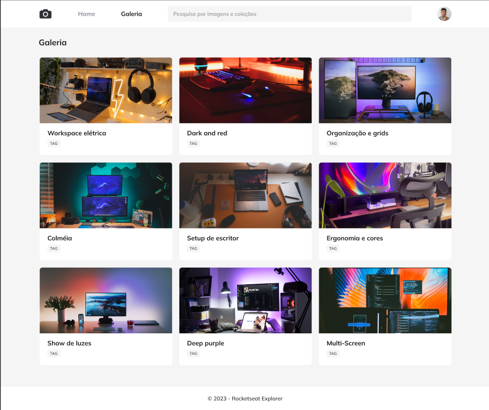

<h1 align="center"> FotoBlog </h1>

Desafio para iniciantes em programação com HTML E CSS  

  

## 🚀 Tecnologias

Esse projeto foi desenvolvido com as seguintes tecnologias:

- HTML e CSS
- Git e Github

 https://viniciusgcampanella.github.io/projetofotoblog/ 
